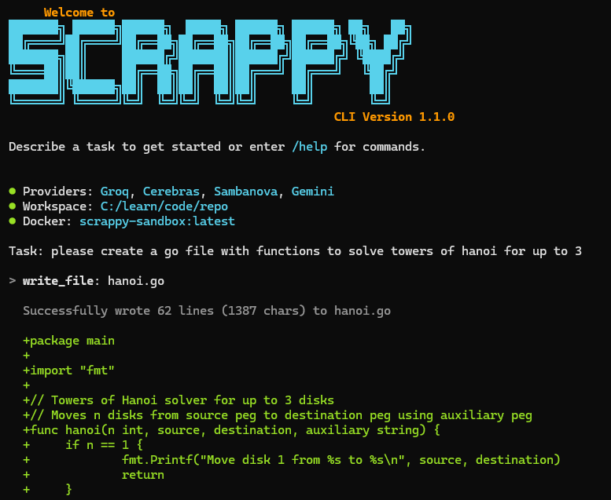

# Scrappy: The Free AI Coding Assistant

[](https://github.com/HakAl/scrappy/actions/workflows/tests.yml)
[](https://badge.fury.io/py/scrappy-ai)
[](https://opensource.org/licenses/MIT)

Orchestrates free tier LLM providers to provide a context-aware coding assistant for everyone.

> "For Users Without Claude Subscription: Yes, Useful"

This tool combines the power of multiple free-tier LLM APIs to give you **23,000+ free, context-aware AI requests per day**. No credit card, subscriptions, or geographic restrictions.



### The Mission: AI for Everyone

Paid AI tools like ChatGPT Plus ($20/month) and Claude Pro ($20+/month) are fantastic, but their cost creates a barrier for:
*   **Students** learning to code. I wish this existed when I was in university, I would have had a lot more free time!
*   **Developers** in regions where $20 is significant or payments are blocked.
*   **Frugal folks** who don't like subscriptions, but like to build and learn.

---

## Requirements

- Python 3.10+
- Git (for checkpoints and safety features)
- Windows, macOS, or Linux

## Quick Start (5 Minutes)

Get up and running with Scrappy in your terminal.

**1. Install the Tool**
```bash
# Mac/Linux
python3 -m venv venv
source venv/bin/activate

# Windows (PowerShell)
# python -m venv venv
# .\venv\Scripts\activate

pip install scrappy-ai
```

**2. Get Your Free API Keys**
You need at least **one** of the following (getting all three is recommended for maximum requests). All are free and require no credit card.

| Provider | How to Get Key                               | Daily Limit     |
| :---     | :---                                         | :---            |
| **Cerebras** | [cloud.cerebras.ai](https://cloud.cerebras.ai) → Sign up → Copy key     | 14,400 requests |
| **Groq**     | [console.groq.com](https://console.groq.com) → Sign up → API Keys | 7,000+ requests |
| **Gemini**   | [aistudio.google.com](https://aistudio.google.com) → Get API Key      | 1,650 requests  |

**3. Run the Setup Wizard**
Scrappy comes with an interactive setup wizard to get you started in seconds.

```bash
scrappy
```

The wizard will:
1.  Prompt you to paste your free API keys (saved securely locally).
2.  **Automatically download** the embedding model (BGE-Small) in the background.
3.  **Index your codebase** using LanceDB for ultra-fast retrieval.

*Note: You'll see a progress bar at the bottom of the screen. You can start chatting immediately while Scrappy indexes your code in the background!*

**4. Instant Coding**
Once configured, Scrappy will immediately start **auto-exploring** your directory.

*   **Zero-Wait:** You can start chatting right away.
*   **Background Indexing:** Scrappy uses `FastEmbed` and `LanceDB` to index your code on a background thread. Watch the status bar at the bottom for real-time progress.

---

> **Note:** Conversations are automatically saved and restored. Just run `scrappy` in any project directory and your previous context loads automatically.

#### **Interactive Commands**
Once inside a session, use these commands:
```
You: /help              # Show all commands
You: /agent <task>      # Run the code agent with human approval
You: /clear             # Clear conversation history
You: /quit              # Exit the session
```

For a full command reference, see the [CLI Documentation](docs/CLI.md).

To customize themes, display settings, and behavior, see the [Customization Guide](docs/CUSTOMIZATION.md).

---

## Common Questions

*   **Q: Is this really free?**
    *   **A:** Yes. It orchestrates the generous free tiers offered by AI providers. No credit card is needed to sign up for their keys.

*   **Q: What if a free tier disappears?**
    *   **A:** The system is designed to be modular. It's easy to add new providers as they become available. As long as *any* free tier exists, this tool will work.

*   **Q: Will my code be kept private?**
    *   **A:** Scrappy has no servers. However, necessary code snippets are sent to the third-party LLM providers (Cerebras/Groq/Google, etc.) to generate answers. Check their privacy policies regarding data training.

*   **Q: What languages does it support?**
    *   **A:** It is language-agnostic and works with any codebase: Python, JavaScript, Java, Go, Rust, etc.

*   **Q: Does Scrappy work offline?**
    *   **A:** The chat requires an internet connection to reach the LLM providers. However, the code indexing and search happen entirely **offline** on your device after the initial 20MB model download.

---

## Technical Details

For more information, please see the detailed documentation:
*   [Architecture Deep Dive](docs/ARCHITECTURE.md)

---

## Disclaimer

Use at your own risk. Be smart: create a branch or work from a clean git state with no uncommitted changes so you can quickly revert.

---

## License
This project is licensed under the **MIT License**. Use it, modify it, and share it to help others access modern AI tools.

If this project helps you, please give it a star on GitHub so others can discover it.